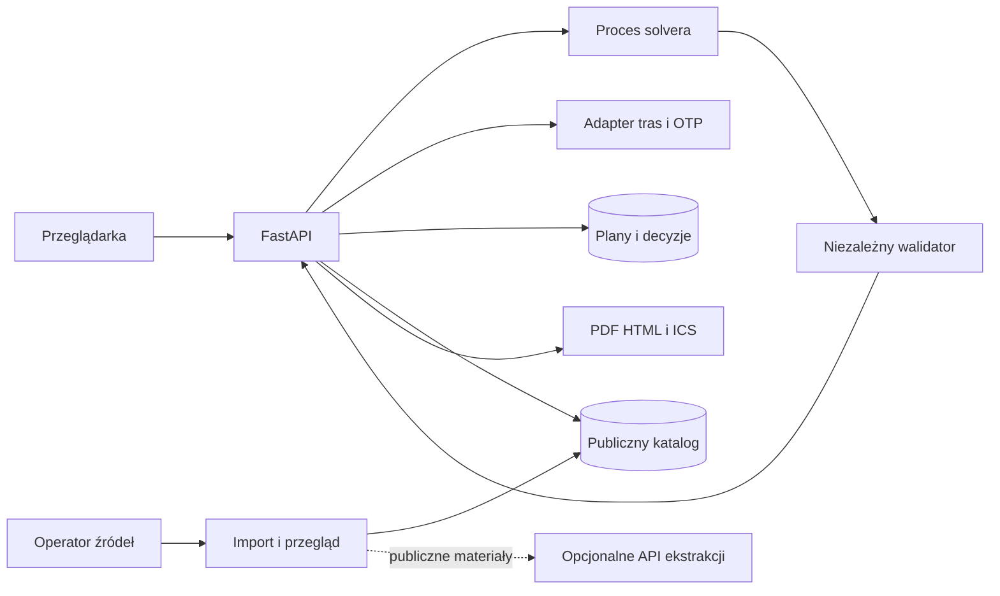

# Okno: końcowy plan rozwiązania ImpactHer

Data: 3 października 2026. Wybrany wariant: **D, „Okno”**, uzupełniony wskazanymi poniżej elementami A, B i C. Status: plan realizacji. Badania, aplikacja, integracje, partnerstwa i wyniki wpływu opisane w tym dokumencie są pracami do wykonania, o ile wyraźnie nie wskazano źródła już istniejących danych.

## 1. Decyzja i wartość produktu

Zbudować aplikację pomagającą kobietom wracającym do pracy lub zwiększającym jej wymiar przejść od konfliktu między pracą, opieką i dojazdem do **wykonalnej, uzgodnionej zmiany warunków oraz sprawdzenia jej efektu**. Użytkowniczka otrzymuje wyjaśnienie przeszkody, porównanie dopuszczalnych rozwiązań i kartę konkretnych godzin do rozmowy z pracodawcą. Może zapisać odmowę lub kontrpropozycję, ponownie przeliczyć plan i sprawdzić go podczas próbnego tygodnia albo pełnego cyklu grafiku.

Hipoteza wartości: część utraconych możliwości pracy wynika z kolizji godzin, które można usunąć przez zmianę organizacji pracy lub opieki. Produkt pozwala ustalić dokładnie, jaki warunek trzeba zmienić, kto może o tym zdecydować i czy zmiana rzeczywiście pomogła. Nie zakłada, że pracodawca będzie elastyczny lub że istnieje dostępne miejsce opieki.

Technicznym rdzeniem jest model ograniczeń i solver, który oblicza wykonalność. AI może pomagać w odczycie publicznych ofert, ale nie rozstrzyga o godzinach, zgodzie pracodawcy ani dostępności opieki. Użytkowniczka zachowuje kontrolę nad granicami, priorytetami i udostępnianiem danych.

Zakres obejmuje cały proces: własną ofertę pracy lub szkolenia, warunki opieki, transport, wykrycie konfliktu, alternatywy, uzgodnienia, zapis i eksport, próbę oraz pomiar wyniku. Kolejność realizacji wynika z zależności produktu. Zakres nie opiera się na szacunku czasu wydarzenia ani liczbie wykonawców.

## 2. Podstawa decyzji i wykorzystanie propozycji

Źródłami wymagań są [TASK.json](TASK.json), [MATERIALS.md](MATERIALS.md), [regulamin kategorii](materials/5b86bc25d29d38e2.pdf.txt) i [szczegóły zadania](materials/2b9442c8e92f3b74.pdf.txt). [Manifest](materials/manifest.json) wskazuje dwa unikalne PDF-y. Oceniono pełne plany [A](proposals/A/PLAN.md), [B](proposals/B/PLAN.md), [C](proposals/C/PLAN.md) i [D](proposals/D/PLAN.md), zgodnie z [proposals/README.md](proposals/README.md). Litery w tym dokumencie oznaczają właśnie te katalogi. Etykiety w historycznym [B/SUMMARIES.md](proposals/B/SUMMARIES.md) nie zmieniają tej identyfikacji.

| Materiał | Zachowany element | Korzyść w końcowym produkcie |
| --- | --- | --- |
| D, sekcje 3-5, 9 i 13 | Zmiana warunków organizacyjnych, karta do uzgodnienia, kontrpropozycje, wersje i pomiar próby | Rekomendacja prowadzi do działania i sprawdzalnego wyniku |
| C, sekcje 5-6 i 11 | Transport zależny od daty i godziny, pełny horyzont, niezależny walidator, rygor optymalizacji | Przesunięcie pracy nie daje pozornego sukcesu przez użycie starego czasu dojazdu |
| C, sekcje 6 i 8 | Ekstrakcja AI wyłącznie publicznych materiałów | Prywatny harmonogram nie jest potrzebny dostawcy modelu |
| A, sekcje 4, 6-7 i 13 | Lista działań i brakujących warunków, własna oferta, zależność kursu i rozpoczęcia pracy | Użytkowniczka wie, co wykonać dalej, także bez kompletnego katalogu |
| B, sekcje 4-5 i 9 | Rzeczywisty podgląd odbiorcy, osobne wersje eksportu, przenośność danych | Pracodawca dostaje wyłącznie zaakceptowany zakres informacji |

Pełne dopasowywanie kompetencji, generowanie CV i zbieranie dowodów umiejętności z A wspierają szerszą ścieżkę poszukiwania pracy. A zawiera również wartościowy solver wykonalności, lecz te dodatkowe moduły nie są potrzebne do rozstrzygnięcia wybranej bariery konkretnego grafiku. Sejf dowodów cyberprzemocy z B stanowi osobny produkt. Nie łączymy domen tylko dla zwiększenia liczby funkcji. Szkolenie obsługujemy jako konkretną aktywność z wymaganymi terminami, a nie jako rozbudowany system doradztwa zawodowego.

## 3. Wymagania i dowody dla jury

Zadanie jest otwarte: wymaga dobrze rozpoznanej potrzeby kobiet, technologicznego rozwiązania oraz praktycznej pozytywnej zmiany. Nie narzuca AI ani objęcia wszystkich wymienionych dziedzin.

| Kryterium z materiałów | Waga | Odpowiedź Okna | Dowód do przygotowania |
| --- | ---: | --- | --- |
| Idea i innowacyjność | 30% | Wyszukiwanie dopuszczalnych zmian otoczenia, wyjaśnienie konfliktu i obieg uzgodnień | Obliczone przed/po, różne kompromisy, porównanie z obecną metodą użytkowniczki |
| Związek z kategorią | 20% | Bariera pracy wynikająca z nierównego obciążenia opieką | Źródła społeczne oraz opis rzeczywistych przypadków z badań kobiet |
| Praktyczność i użyteczność | 20% | Własna oferta, plan działania, zgoda lub odmowa, próba i wynik | Samodzielne przejście pełnej ścieżki oraz ocena przydatności karty przez osoby układające grafiki |
| Design | 20% | Czytelny konflikt, tydzień przed/po, podgląd odbiorcy, obsługa telefonu | Działający interfejs, testy zrozumienia statusów, klawiatury i czytnika ekranu |
| Kompletność i wartość wdrożeniowa | 10% | Poprawne obliczenia, dane i ich utrzymanie, wersjonowanie, eksport, odtwarzalny start | Testy, instrukcja uruchomienia, publiczne demo, określony operator i koszty |

Innowacyjność oceniamy przez dodatkową korzyść wobec kalendarza, katalogu i doradztwa. Samo użycie solvera nie dowodzi przewagi. Jakość designu musi zostać wykazana na działającym interfejsie, a nie wywnioskowana z długości opisu.

## 4. Odbiorczynie i walidacja potrzeby

Pierwsza grupa to kobiety z konkretną ofertą lub grafikiem, które wracają po przerwie opiekuńczej albo chcą zwiększyć wymiar pracy. Uwzględniamy samotną opiekę, kilku podopiecznych, opiekę nad dorosłym, nieregularne zmiany, ograniczony transport i brak pieniędzy na dodatkową usługę. Partner, samochód i praca zdalna nie są domyślnymi zasobami. Narzędzie może służyć innym opiekunom; dopasowanie do ImpactHer wynika z rozpoznanej bariery i badań z kobietami.

Polski raport EIGE CARE 2024 wskazuje nierówny udział kobiet i mężczyzn w intensywnej opiece oraz podziale obowiązków. Uzasadnia wybór obszaru, lecz nie dowodzi popytu na Okno ani skuteczności negocjowania godzin. Źródło sprawdzone podczas przygotowania tego planu: [EIGE, Gender gaps in care: Poland, s. 1-4](https://eige.europa.eu/sites/default/files/documents/202600328.23_pdf_mh0126009enn_002.pdf).

Plan badania jakościowego: 12 kobiet o zróżnicowanych warunkach opieki i transportu, 3 osoby układające grafiki oraz 2 doradców zawodowych. To proponowana próba do rozpoznania potrzeb, nie badanie reprezentatywne. Kontakt i rekrutacja pozostają przyszłymi czynnościami; nie zostały wykonane w ramach tego planu.

Sprawdzić ostatnią odrzuconą ofertę lub trudny tydzień, rzeczywisty powód konfliktu, dotychczasowy sposób rozwiązania, dostępność potrzebnych danych i możliwość zmiany godzin. Po stronie pracodawcy sprawdzić, kto podejmuje decyzję, jakie warunki mogą się zmienić i czy karta zawiera wystarczające informacje. Zmierzyć również wysiłek wprowadzania danych i organizowania uzgodnień.

Przed pilotażem wykonać porównanie funkcji aktualnego portalu pracy, narzędzia do planowania kalendarza i inicjatywy wspierającej powroty zawodowe. Kryteria: wspólne ograniczenia, kontrpropozycje, prywatność, aktualność danych i pomiar rzeczywistego rezultatu. Nie deklarować pierwszeństwa rynkowego.

Warunek dalszego wdrożenia: badania muszą ujawnić powtarzalne przypadki, w których dopuszczalna zmiana usuwa barierę, a odbiorcy rozumieją kartę i mogą podjąć decyzję. Jeśli dominują brak miejsc opieki i całkowicie sztywne grafiki, raportować tę granicę i ponownie ocenić wartość kanału wdrożenia. Nie ukrywać negatywnych wyników walidacji za atrakcyjnym demo.

## 5. Pełna ścieżka użytkowniczki

1. **Cel i granice.** Start bez konta, CV i importu kalendarza. Własna oferta pracy, kurs albo obecny grafik; wymagany wymiar pracy, daty, budżet i odpoczynek. Osobno oznaczyć warunki nienaruszalne oraz takie, o których można rozmawiać. Mniejszy wymiar pracy wymaga osobnego wyboru użytkowniczki.
2. **Tydzień i wyjątki.** Wprowadzenie obowiązkowych zmian, dostępności opiekunów, potrzeb opieki, godzin placówek, przekazań i dojazdów. Formularz dopuszcza „nie wiem”. Powtarzalny tydzień rozwija się na rzeczywiste daty. Widok 28 dni jest ustawieniem startowym, nie granicą poprawności całego grafiku.
3. **Diagnoza.** Pokazanie konkretnej kolizji, np. odbioru 45 minut po zamknięciu placówki, oraz danych, z których wynika. Niekompletne dane prowadzą do pytań, nie do zmyślonego wyniku.
4. **Warianty.** Do trzech różnych propozycji: zmiana godzin pracy, inne dopuszczone przekazanie opieki, odpowiednia usługa lub inna wprowadzona oferta. Każda pokazuje wymiar pracy, koszt, dojazdy, zapas czasu, obciążenie użytkowniczki i listę wymaganych zgód. Wszystkie własne oferty pozostają widoczne, także odrzucone przez model.
5. **Następne działania.** Lista zależności z osobą odpowiedzialną, terminem i źródłem: zapytać o godziny, sprawdzić miejsce, uzgodnić odbiór. Kolejność wynika z zależności; nie ma zadania aplikowania na niewykonalną ofertę jako automatycznej porady.
6. **Karta uzgodnienia.** Wybór odbiorcy i podgląd dokładnie tego, co otrzyma. Dla pracodawcy: proponowane godziny, dopuszczalna elastyczność i okres próby. Dla innego opiekuna: wybrane obowiązki przekazania. Dla doradcy: wybrany przez użytkowniczkę zakres. Eksport PDF, tekstu lub dostępnego HTML; bez automatycznej wysyłki.
7. **Decyzja i ponowne obliczenie.** Zapis akceptacji, odmowy lub kontrpropozycji z datą, zakresem i ważnością. Relacja użytkowniczki pozostaje tak oznaczona. Każda zmiana grafiku lub zasobu tworzy nową wersję i ponowne sprawdzenie.
8. **Próba.** Po aktualnym obliczeniu i potwierdzeniu wymaganych zależności użytkowniczka rozpoczyna próbny tydzień albo pełny cykl. Eksport ICS obejmuje wybrane zdarzenia. Wcześniej zapisuje okres odniesienia: rzeczywistą pracę, koszty i obciążenie.
9. **Wynik i dalszy plan.** Podsumowanie rzeczywiście wykonanych godzin, kosztów, zakłóceń i wysiłku organizacyjnego. Zmiana warunków unieważnia bieżącą gotowość i uruchamia naprawę planu. Historia pierwotnej próby pozostaje czytelna.

Brak rozwiązania jest pełnoprawnym wynikiem. Aplikacja wskazuje, czy przyczyną są dane, koszt, brak zasobu, odmowa zmiany czy brak rozstrzygnięcia obliczeń. Użytkowniczka może pobrać zwięzły opis bariery do rozmowy z doradcą. Nie dostaje oceny własnej zaradności.

## 6. Dane i stany produktu

Oddzielić cztery warstwy: wynik matematyczny, jakość danych, ustalenia stron i rzeczywisty rezultat. Jedno pole „sukces” nie może ich zastępować.

| Warstwa | Reprezentacja i zasada |
| --- | --- |
| Solver | `OPTIMAL`, `FEASIBLE`, `INFEASIBLE`, `UNKNOWN`, `MODEL_INVALID`; status dotyczy konkretnego modelu i zakresu dat |
| Dane | `complete`, `needs_input`, `stale`; każde istotne pole ma pochodzenie i okres ważności |
| Wariant | `draft`, `awaiting_confirmation`, `confirmed`, `trial`, `completed`, `rejected`, `expired` |
| Ustalenie | Strona, decyzja, zakres godzin i dat, źródło, data zapisu, ważność, wersja wejścia |
| Wynik próby | Godziny i koszty faktyczne, okres odniesienia, brakujące dane, metoda potwierdzenia; oddzielony od symulacji |

`confirmed` wymaga poprawnego, aktualnego wyniku i potwierdzenia każdej niezbędnej zależności w sprawdzanym okresie. Komunikat brzmi „potwierdzone według zapisanych ustaleń”, jeśli źródłem jest deklaracja użytkowniczki. Sam eksport nie potwierdza zgody. Rozpoczęta próba z nowym konfliktem otrzymuje widoczną blokadę dalszej realizacji do ponownej oceny; dotychczasowe obserwacje nie są kasowane.

Istotne encje:

- `Scenario` i `ScenarioVersion`: właściciel, cel, daty, granice i wersja schematu.
- `Activity` i `Constraint`: pełna zmiana pracy lub zajęcia, opieka, odpoczynek, wyjątki, warunek twardy lub dopuszczona zmiana.
- `CareResource`: dostępność, zakres opieki, pojemność, koszt, potwierdzenie konkretnego przyjęcia.
- `TravelLeg`: kierunek, sposób transportu, dzień i pora, podróż, przekazanie i bufor, źródło i ważność.
- `SourceRecord`: publiczna oferta/usługa oraz pochodzenie każdego istotnego pola.
- `SolveRun` i `Alternative`: wersja danych i solvera, wynik, konflikty, zmiany, koszty, dowód lub brak dowodu optimum.
- `Dependency`, `Decision` i `ActionItem`: potrzebne uzgodnienia, odpowiedzi i dalsze kroki.
- `ExportSnapshot` i `Outcome`: zakres udostępnienia konkretnej wersji oraz obserwacje z próby.

Potwierdzenia wskazują pola i daty, od których zależą. Zmiana powiązanego pola unieważnia je transakcyjnie; niepowiązane potwierdzenie może pozostać ważne. Niepewna zależność powoduje konserwatywne żądanie ponownego potwierdzenia. Nie modyfikujemy historii decyzji, tylko ich aktualną przydatność. Po odtworzeniu backupu dawne ustalenia są historią do ponownej oceny, nie niezależnym dowodem zgody.

## 7. Silnik wykonalności i wariantów

Wybrać OR-Tools CP-SAT z własnym modelem problemu. Czas reprezentować w całkowitych minutach, pieniądze w groszach. Statusy i ograniczenie do liczb całkowitych opisuje [dokumentacja CP-SAT](https://developers.google.com/optimization/cp/cp_solver). Własnym wkładem są model opieki, negocjowalnych warunków, walidator i obieg decyzji.

### Model czasu, opieki i kosztów

Używać półotwartych przedziałów `[start, end)`, jawnego czasu przekazania i rzeczywistych dat w strefie `Europe/Warsaw`. Rozwinąć powtórzenia i wyjątki; niejednoznaczne lub nieistniejące godziny przy zmianie czasu wymagają rozstrzygnięcia. Oddzielić czas obecności od czasu płatnego i przerw.

Każdy wymagany przedział opieki ma pokrycie przez dopuszczony zasób. Opiekun nie może jednocześnie realizować sprzecznych zobowiązań, a transfer pomiędzy miejscami zajmuje czas. Kilku podopiecznych można objąć jednocześnie tylko przy jawnie podanej pojemności i zgodności opieki. Praca zdalna nie tworzy automatycznie dostępności do samodzielnej opieki. Nie dodawać fikcyjnego opiekuna ani nie pomijać obowiązkowych zajęć.

Sprawdzać pełny podany cykl grafiku oraz wszystkie obowiązkowe daty kursu. Jeśli kurs jest warunkiem zatrudnienia, musi zakończyć się przed startem pracy. Dla umowy bez daty końca komunikat zawsze określa sprawdzony okres; nie potwierdza wykonalności na nieograniczoną przyszłość. Dłuższy przypadek można podzielić obliczeniowo z zachowaniem warunków na granicach, lecz wynik częściowy nie staje się wynikiem całego okresu.

Koszt obejmuje opiekę, dojazdy i zajęcia w tym samym okresie, z rozróżnieniem opłat jednorazowych i cyklicznych. Nieznany koszt pozostaje nieznany. Przy twardym budżecie brak wymaganej ceny blokuje potwierdzenie wykonalności kosztowej. Nie wyliczać dochodu netto ani prawa do świadczeń z niepełnych danych.

### Przebieg obliczenia

1. Walidacja kompletności, zgodności dat i zakresu zmiennych. Brak krytycznych godzin prowadzi do `needs_input`. Można pokazać już znany konflikt, bez udawania pełnego wyniku.
2. Sprawdzenie grafiku bazowego na zasobach i ustaleniach potwierdzonych dla danego okresu.
3. Diagnoza sprzeczności w osobnym modelu bez celu. Nazwane grupy ograniczeń podłączyć przez wspierane mechanizmy warunkowania do assumptions, z jednym workerem. Nie zakładać, że każdą globalną regułę można bezpośrednio warunkować. Model sprawdzić walidatorem OR-Tools przed obliczeniem. Rdzeń jest wystarczającym zestawem konfliktów, nie obietnicą najmniejszego zestawu; pusty rdzeń wymaga diagnostyki stałej części modelu. Źródło: [oficjalna dokumentacja assumptions](https://github.com/google/or-tools/blob/stable/ortools/sat/docs/troubleshooting.md).
4. Osobny model wariantów zmienia tylko parametry jawnie dopuszczone do negocjacji. Nowa usługa z kompletem godzin i kosztów może utworzyć propozycję warunkową, ale brak przyjęcia tworzy zależność blokującą potwierdzenie. Nieznanej ceny nie zastępujemy hipotetycznym zerem.
5. Przy zachowaniu wymiaru pracy, opieki, budżetu i odpoczynku minimalizować kolejno liczbę zmienianych ustaleń, skalę zmian godzin i dodatkowy koszt. Użytkowniczka może zmienić kolejność preferencji. Jedna zgoda na tygodniowy grafik jest jednym ustaleniem, a nie pięcioma niezależnymi decyzjami.
6. Pokazać odrębny wariant z większym zapasem i ewentualnie inny sposobem organizacji opieki. Usuwać duplikaty o tych samych decyzjach. Nie sumować minut, pieniędzy i obciążenia w niejawny ranking.
7. Dla wybranych godzin ponownie sprawdzić transport i cały model. Niezależny walidator, działający na znormalizowanych danych wejściowych, kontroluje pokrycie opieki, kolizje, transfery, koszt i wymiar pracy. Błąd blokuje prezentację wariantu jako wykonalnego.

Przy celach optymalizowanych kolejno utrwalać poprzednie minimum tylko po dowodzie optimum. „Najmniejsza zmiana” wymaga zerowych tolerancji i dowodu dla odpowiednich etapów. Przy limicie używać „najlepszy znaleziony wariant”. `UNKNOWN` nie oznacza braku rozwiązania; `INFEASIBLE` odnosi się do zadanych danych i dozwolonych zmian. Jeśli sprawdzenie tras jest tylko przybliżone albo obejmuje ograniczony zestaw godzin, zakres tego ograniczenia musi być częścią wyniku, również przy wewnętrznym `OPTIMAL`. `INFEASIBLE` dla takiego modelu oznacza brak wariantu w sprawdzonej domenie, nie dowód braku rzeczywistej możliwości poza nią; interfejs musi zachować to rozróżnienie.

Test odporności obejmuje dodatkowe opóźnienie, odwołanie opieki i nieobecność opiekuna. Pokazuje konsekwencje konkretnych zakłóceń, bez wymyślania ich prawdopodobieństwa. Bufor bazowy i dodatkowy zapas wariantu to osobne wielkości.

## 8. Transport, katalog i rola AI

**Pełnoprawne dane własne.** Użytkowniczka może wpisać ofertę, usługę, godziny i czasy przejazdu. Produkt nie wymaga zapełnionego katalogu, logowania do portalu pracy ani dostępu do płatnego API. Własny czas dojazdu ma kierunek, zakres pór i dni, źródło „deklaracja użytkowniczki” oraz bufor. Po przesunięciu poza ten zakres konieczne jest ponowne potwierdzenie.

**Transport obliczany.** Adapter OpenTripPlanner z OSM i GTFS dostarcza trasy piesze i komunikacją publiczną. Pierwsza instancja danych obejmuje Kraków i dojazdy, ze względu na lokalny zbiór do walidacji; model nie jest związany z jednym miastem. Dostępne punkty wejścia sprawdzone przy planowaniu: [OpenTripPlanner](https://www.opentripplanner.org/) i [katalog GTFS ZTP Kraków](https://gtfs.ztp.krakow.pl/). Nie zbudowano grafu ani nie potwierdzono jakości konkretnych tras.

Tablice tras zależą od daty, godziny, środka transportu i ważności feedu. Po zmianie początku pracy ponownie sprawdzić poranny dowóz oraz powrót. Jeśli dokładna trasa unieważnia kandydata, wykluczyć ten wariant i ponowić obliczenie w budżecie; po wyczerpaniu zwrócić brak rozstrzygnięcia. Przy braku danych można wybrać własny czas, jawnie oznaczając jego pochodzenie. Nie zastępować transportu publicznego czasem jazdy samochodem ani wygasłego GTFS ostatnim poprawnym wynikiem.

**Publiczny katalog.** Źródłami do sprawdzenia podczas implementacji są rejestr żłobków Empatia, oficjalne strony placówek, lokalne usługi opieki nad dorosłymi, oferty pracy i organizatorzy konkretnych kursów. Dostarczony workspace nie zawiera gotowego korpusu takich rekordów. Najpierw zweryfikować eksport/API, warunki użycia i przykładowe rekordy. Ręczny, redakcyjnie sprawdzony CSV/JSON jest równoważnym sposobem zasilania. Dostępność publicznej strony nie oznacza prawa do masowej redystrybucji.

Każde pole istotne dla decyzji ma URL lub źródło osobiste, datę pozyskania i sprawdzenia, okres obowiązywania oraz status. Rekordy publiczne przechodzą `draft -> reviewed -> published -> stale/withdrawn`. Liczba miejsc w rejestrze nie potwierdza przyjęcia konkretnego dziecka. Potwierdzenie miejsca, godzin i kosztu jest prywatną zależnością konkretnego planu. Nie łączyć fikcyjnych wolnych miejsc z nazwą prawdziwej placówki.

Operator sprawdza zmiany źródeł i ważność danych przed użyciem w nowym planie. Aktualizacje ofert i feedów kontroluje codziennie, pozostałe terminy ustala według źródła. Samo pobranie nie przedłuża potwierdzenia prywatnego. Przy zmianie danych plan traci bieżącą gotowość, ale zachowuje migawkę potrzebną do odtworzenia wcześniejszej decyzji.

**Opcjonalne usługi.** Groq i Firecrawl są kandydatami wskazanymi w propozycjach. W tym planowaniu nie sprawdzano sekretów, limitów kont ani inferencji; relacji autorów o wcześniejszych testach nie uznajemy za aktualny test tego produktu. Lokalny [SERVICES.md](SERVICES.md) jest odnośnikiem do katalogu, nie dowodem działającej integracji.

Firecrawl może pobierać wyłącznie dozwolone publiczne strony w procesie redakcyjnym. Groq może wyodrębniać jawnie podane godziny i koszty z publicznej treści, wraz z fragmentem źródłowym dla każdego pola. Kandydat modelu z propozycji to `openai/gpt-oss-120b`; wybór wymaga aktualnej weryfikacji dostępności, formatu odpowiedzi, kosztu i testu polskich dokumentów. Do modelu nie trafiają prywatne ograniczenia ani kompletne kalendarze. Wynik przechodzi schemat, walidację semantyczną i zatwierdzenie redaktora. Brak wartości to `null`, nigdy domyślna godzina. Treść źródeł pozostaje niezaufanymi danymi. Model nie ma narzędzi wysyłki, publikacji ani dostępu do planów.

## 9. Interfejs i dostępność

Główne ekrany: rozpoczęcie, cel i tydzień, konflikt, porównanie wariantów, karta odbiorcy, ustalenia, wynik próby. Formularz pokazuje kolejne potrzebne grupy danych i pozwala wracać bez utraty pracy. Szczegóły źródła i obliczenia są rozwijane przy konkretnym wyniku.

Kluczowy ekran porównuje tydzień obecny i proponowany, wskazując zmianę godzin, pozostały zapas, koszt oraz decyzje do uzgodnienia. Telefon pokazuje czytelne karty dni; większy ekran także oś tygodnia. Równoważna lista tekstowa i edycja formularzem muszą zapewniać te same funkcje co przeciąganie bloków.

Prosty polski, neutralny ton, kontrastowe tło i tekst, jeden główny akcent. Każdy stan ma opis i ikonę, nie sam kolor. Nie używać ocen „zaradności”, stereotypowej oprawy ani komunikatu sugerującego, że niepotwierdzony wariant jest rezerwacją. Puste wyniki, timeout, utrata sieci i stare dane mają własne zrozumiałe komunikaty.

Cel jakości: WCAG 2.2 AA, pełna klawiatura, logiczny fokus, czytnik ekranu, powiększenie, reflow i ograniczenie animacji. Testować szerokość 360 px oraz 320 CSS px, powiększenie 200% i zachowanie przy 400%. Biblioteka komponentów i skan automatyczny nie stanowią potwierdzenia dostępności całego produktu.

## 10. Architektura i kontrakty

| Warstwa | Decyzja |
| --- | --- |
| Frontend | React, TypeScript, Vite; Radix, React Hook Form i Zod; klient generowany z OpenAPI |
| API | Python, FastAPI i Pydantic; jeden backend dla walidacji, wersji i obliczeń |
| Obliczenia | OR-Tools w ograniczonej puli osobnych procesów; niezależny walidator wyników |
| Trwałość | PostgreSQL, SQLAlchemy i Alembic; osobne publiczne rekordy i prywatne plany |
| Transport | Własny OpenTripPlanner z przypiętym grafem OSM/GTFS oraz adapter czasów ręcznych |
| Eksport | Kontrolowany HTML do PDF przez Playwright/Chromium; `icalendar` do ICS; JSON do kopii własnej |
| Importy | Oddzielne polecenia operatora, CSV/JSON i publiczne strony; opcjonalnie Firecrawl/Groq |
| Uruchomienie | Docker Compose, frontend i API pod jedną domeną, reverse proxy z TLS |

Dobór jest decyzją projektową, nie deklaracją przetestowanej kompatybilności. W implementacji przypiąć wersje bibliotek, runtime i obrazów, sprawdzić dokumentację oraz test czystej instalacji. Nie tworzyć dodatkowej bazy reaktywnej lub backendu tylko dla samej dostępności usługi.

| API | Wynik i zasada |
| --- | --- |
| `POST /api/solve` | Scenariusz, daty, dopuszczone zmiany; wynik, braki, konflikty, warianty, zakres dowodu i wersja wejścia; bez domyślnego zapisu |
| `POST /api/routes` | Trasy dla konkretnych dat i godzin, pochodzenie i ważność; brak trasy jest jawnym wynikiem |
| `GET /api/catalog` | Wyłącznie publiczne rekordy, ze źródłami i statusem |
| `POST /api/plans`, `GET /api/plans/{id}` | Dobrowolny zapis i odczyt właściciela |
| `POST /api/plans/{id}/versions` | Nowa wersja przy zgodnym `expected_version`; konflikt zwraca 409 |
| `POST /api/plans/{id}/decisions` | Decyzja z wersją i zakresem; ponowna ocena zależności |
| `POST /api/plans/{id}/outcomes` | Obserwacje z datami, bazą i pochodzeniem, oddzielne od wyniku solvera |
| `POST /api/export` | Eksport z zamkniętej listy zatwierdzonych pól i identyfikatorem wersji podglądu |
| `GET /api/plans/{id}/backup`, `POST /api/import` | Własna wersjonowana kopia i import jako nowy plan; walidacja rozmiaru i schematu |
| `DELETE /api/plans/{id}` | Usunięcie planu, zależnych danych i unieważnienie trwających zapisów |
| `GET /health/live`, `GET /health/ready` | Stan procesu i wymaganych składników w aktywnym profilu, bez danych prywatnych |

Każde żądanie mutacji ma identyfikator idempotencji i wersję. Spóźniona odpowiedź nie zastępuje aktualnej edycji. Anulowanie, usunięcie planu lub sesji uniemożliwia późniejszy zapis starego zadania. Cały przebieg obliczeń, łącznie z trasami, diagnozą i wariantami, ma wspólny limit czasu oraz pamięci. Kolejka jest ograniczona; jej przepełnienie zwraca kontrolowany błąd zamiast nieograniczonego uruchamiania procesów.

## 11. Prywatność, eksport i kontrola dostępu

Tryb bez zapisu przechowuje formularz w pamięci przeglądarki, ale dane potrzebne do obliczeń trafiają do własnego API i procesu tras. Nie nazywać tego przetwarzaniem wyłącznie lokalnym ani anonimowym. Używać etykiet podopiecznych, bez nazwisk, diagnoz i pełnych kalendarzy. Dokładny adres nie jest obowiązkowy; przy punkcie orientacyjnym uwzględnić brakujący odcinek podróży.

Zapis na serwerze wymaga osobnego działania. Właścicielem jest losowa sesja w cookie HttpOnly, Secure i SameSite. Każdy odczyt, eksport i zapis sprawdza właściciela. Dodać ochronę CSRF, limity oraz kontrolę origin. Sesja nie weryfikuje tożsamości pracodawcy. Utrata cookie może oznaczać utratę dostępu; komunikat przed zapisem i kopia JSON umożliwiają świadomy wybór. Pilotaż asystowany przez doradcę może odbywać się przy tym samym urządzeniu; nie daje doradcy dostępu do innych planów.

Podgląd odbiorcy powstaje z tego samego, wersjonowanego obiektu danych co eksport. Stosować listę dozwolonych pól, nie usuwanie wybranych pól z całego prywatnego planu. Karta pracodawcy nie zawiera przyczyn rodzinnych, nazw placówek, kosztów osobistych ani identyfikatorów podopiecznych. Sprawdzić również nazwy plików, metadane, warstwę tekstową i linki. Zmiana danych lub zakresu unieważnia wcześniejszy podgląd. Kopia własna jest oddzielnym eksportem i nie trafia do paczki odbiorcy.

ICS umożliwia aktualizację zdarzeń przez stabilne UID i wersję, ale nie daje aplikacji kontroli nad kalendarzem odbiorcy. Wyjaśnić, że wcześniej pobranych plików i zaimportowanych wydarzeń nie można zdalnie cofnąć. Eksport roboczego wariantu musi być oznaczony jako propozycja; nie zmienia stanu uzgodnień.

Prywatne odpowiedzi mają `Cache-Control: no-store`. Wyłączyć zapis treści w logach, trace'ach, nagraniach sesji i raportach błędów. Zaszyfrować dyski i backupy, ograniczyć dostęp operatora. Proponowana retencja: 30 dni bez aktywności, z jawnym przedłużeniem; kopie zapasowe do 7 dni. Usunięcia muszą być respektowane przy odtwarzaniu. To założenia do zatwierdzenia z przyszłym operatorem, nie twierdzenie o spełnieniu wszystkich wymagań prawnych.

Importer ma listę dozwolonych domen, kontrolę przekierowań, blokadę adresów prywatnych, limity i sanitizację. Renderer PDF nie pobiera zewnętrznych zasobów ani URL podanych przez użytkowniczkę. Administrowanie katalogiem odbywa się przez narzędzie operatora poza publicznym API. Przed pilotażem rzeczywistych danych ustalić operatora, zasady przetwarzania i obsługę incydentów.

## 12. Uruchomienie, koszty i utrzymanie

Planowany układ repozytorium: `web/`, `api/`, `api/solver/`, `api/validation/`, `data/catalog/`, `data/synthetic/`, `infra/otp/`, `tests/`, `scripts/`, `compose.yaml`, `.env.example`, `README.md`, `SOURCES.md`, `THIRD_PARTY.md`, `AI_USAGE.md` i `PREEXISTING.md`. To pliki do utworzenia przy implementacji, nie istniejące elementy tego workspace.

Profile uruchomienia:

- `core`: frontend, API, solver i baza; własne dane, ręczny czas podróży, syntetyczny katalog, brak zewnętrznych API.
- `transit`: dodatkowo OTP i wersjonowany graf, ważność rozkładów widoczna w wynikach.
- `imports`: osobny proces pobierania i przeglądu publicznych danych, ewentualnie ekstrakcja AI.

Pełny plan obejmuje wszystkie te możliwości. Profile pozwalają jawnie działać przy awarii lub braku konfiguracji integracji; nie zastępują testów pełnego wdrożenia.

| Konfiguracja | Wartość początkowa lub warunek |
| --- | --- |
| `APP_ORIGIN`, `APP_TIMEZONE` | Lokalny adres aplikacji, następnie domena HTTPS; `Europe/Warsaw` |
| `DATA_MODE` | `synthetic` lub `verified`, widoczne w interfejsie |
| `ROUTING_MODE` | `manual` lub `otp`, źródło zapisane dla każdego odcinka |
| `LLM_MODE` | Domyślnie `off`; tylko importer publicznych danych |
| `SOLVER_TOTAL_BUDGET_SECONDS` | Startowo 20 s na analizę; limit obejmuje wszystkie etapy |
| `SOLVER_MAX_CONCURRENT` | Startowo 2, do pomiaru na docelowym hoście |
| `PLAN_RETENTION_DAYS`, `BACKUP_RETENTION_DAYS` | Proponowane 30 i 7 |
| Sekrety bazy i sesji | Nowe, osobne wpisy psst dla aplikacji, migratora, administratora i sesji |
| Sekrety opcjonalnych API | Tylko importer, po sprawdzeniu właściwych wpisów i warunków usługi |

`.env.example` zawiera wyłącznie ustawienia publiczne i nazwy sekretów. psst przekazuje wybrane wartości do procesu; Compose musi jawnie mapować je tylko do właściwych kontenerów. Klucze nie trafiają do `VITE_*`, obrazu, repozytorium ani logów. Rola aplikacji nie jest administratorem PostgreSQL; migracje mają osobną rolę i jednorazowy serwis.

Sekwencja dostarczenia: przypiąć runtime i zależności, zbudować obrazy, uruchomić bazę z healthcheck, wykonać migracje, idempotentnie załadować syntetyki, uruchomić API i frontend, następnie włączyć przetestowane profile tras i importów. README musi podawać rzeczywiste komendy działające od czystego checkoutu. Baza, OTP i procesy robocze pozostają w sieci prywatnej; na zewnątrz dostępna jest domena HTTPS.

Koszt utrzymania liczyć jako hosting API/bazy, pamięć i aktualizacje OTP, backupy, importy, ewentualna inferencja oraz praca weryfikacji danych i wsparcia. Mierzyć koszt ukończonej analizy i utrzymania katalogu, nie sam koszt tokenów. Limity importu, cache publicznych rekordów i budżet wywołań zapobiegają niekontrolowanym kosztom. Ceny, konto, domena i zasoby hostingu wymagają wyboru przy realizacji.

Potencjalny operator: organizacja wspierająca powroty do pracy, instytucja rynku pracy lub samorząd. Bezpłatny dostęp dla użytkowniczek jest założeniem modelu; finansowanie utrzymania wymaga potwierdzenia. Nie sprzedawać danych rodzin ani pozycji w rankingu wariantów. Wyznaczyć właściciela produktu, opiekuna technicznego, redaktora katalogu i osobę wsparcia. Nie ma obecnie zawartego partnerstwa.

## 13. Etapy realizacji i odbiór

| Etap | Rezultat | Warunek ukończenia |
| --- | --- | --- |
| 1. Potrzeba i reguły | Badania barier, możliwości negocjacji, mapa źródeł, wyjaśnienie zasad zgłoszenia | Dowody oddzielone od hipotez; zdefiniowane przypadki wartości i ograniczenia |
| 2. Kontrakty | Schematy czasu, opieki, kosztów i decyzji; ręcznie wyliczone syntetyki | Jednoznaczna definicja poprawnego i warunkowego wyniku |
| 3. Solver | Wykonalność, konflikty, dopuszczalne zmiany, różne warianty i walidator | Zgodność z niezależnym wyliczeniem małych przypadków |
| 4. Dane i transport | Import ręczny i katalog, OTP, pochodzenie pól i ważność tras | Zmiana godziny powoduje rzeczywiste sprawdzenie dojazdu |
| 5. Pełny interfejs | Własna oferta, tydzień, konflikty, warianty i lista działań | Osoba spoza zespołu rozumie wynik i kolejny krok |
| 6. Uzgodnienia i próba | Zapis, wersje, decyzje, podgląd, eksport, odniesienie i wynik | Odmowa i kontrpropozycja poprawnie zmieniają proces; symulacja nie zwiększa efektu |
| 7. Odporność i wdrożenie | Prywatność, dostępność, limity, backup i instrukcja | Czyste uruchomienie oraz pełny test przez docelowy HTTPS |
| 8. Pilotaż i zgłoszenie | Badanie użyteczności, dowody, prezentacja, disclosure | Wyniki opisane zgodnie ze stanem faktycznym i komplet materiałów do oceny |

Po etapie kontraktów interfejs, model solvera i przygotowanie danych mogą powstawać równolegle. Integracja opiera się na wspólnych przykładach wejścia i wyjścia. Brak API źródłowego uruchamia opisany adapter ręczny; nie jest podstawą do udawania gotowej integracji.

## 14. Testy i kryteria jakości

Poniższe wartości są celami odbioru, nie wynikami już przeprowadzonych testów.

| Obszar | Dowód i wymaganie |
| --- | --- |
| Czas i pokrycie | Przypadki samotnej opieki, wielu podopiecznych, dwóch miejsc, opieki nad dorosłym, nocy, zmiany czasu, świąt i wyjątków; zero naruszeń twardych warunków w zaakceptowanych wynikach |
| Optymalizacja | Małe przypadki porównane z pełnym wyliczeniem; brak deklaracji minimalności bez dowodu; test `UNKNOWN`, niepełnej optymalizacji i konfliktu w stałej części modelu |
| Walidator | Celowo uszkodzony harmonogram, brak transferu, podwójne przypisanie i zaniżony koszt muszą zostać odrzucone |
| Transport | Przesunięcie zmiany trafia na inny rozkład, brak powrotu, wygasły feed i różne kierunki; końcowa trasa odpowiada wybranej godzinie |
| Braki danych | Nieznany koszt, godzina, przyjęcie lub wygasła zgoda nigdy nie daje potwierdzonego wyniku |
| Uzgodnienia | 409 dla starej wersji, idempotencja, odmowa, kontrpropozycja, wygaśnięcie, import kopii i unieważnienie dokładnie zależnych ustaleń |
| Prywatność eksportu | Znaczniki prywatnych danych nie występują w karcie pracodawcy, metadanych i nazwach; podgląd odpowiada dokładnie pobranej wersji |
| Dostęp i usunięcie | Próba odczytu z innej sesji, CSRF, usunięcie podczas obliczeń, odtworzenie backupu i brak odtworzenia skasowanego planu przez spóźnione zadanie |
| Integracje AI | Co najmniej 50 publicznych polskich przykładów z etykietami, negacją i brakami; każde zaakceptowane pole ma prawidłowe źródło; awaria zachowuje formularz |
| UX i dostępność | Telefon, klawiatura, czytnik, zoom, reflow, axe i test ręczny; brak krytycznych przeszkód w pełnej ścieżce |
| Wydajność | Referencja: 28 dni, do 3 opiekunów, 3 podopiecznych i 10 zasobów opieki; cel p95 bazowej analizy do 3 s na opisanym sprzęcie, limit całej analizy 20 s; podać próbę i zimny start |
| Dostarczenie | Czysty checkout, migracje, zapis/odczyt, eksport i powrót do planu przez publiczny HTTPS; lokalny health nie jest dowodem dostępności demo |

Testy właściwości obejmują także fakt, że zaostrzenie ograniczeń nie dodaje matematycznie wykonalnych rozwiązań. Testować zbiór możliwości na małych instancjach, nie kolejność wyników heurystycznego wyszukiwania przy limicie czasu. Brak krytycznych błędów w zestawie nie oznacza dowodu poprawności dla każdego realnego przypadku.

## 15. Pomiar wpływu

| Miernik | Definicja |
| --- | --- |
| Możliwość obliczona | Godziny pracy w znalezionym wariancie dla określonych dat; wyłącznie symulacja |
| Zmiana uzgodniona | Liczba wariantów z aktualnymi potrzebnymi ustaleniami, z jawnym źródłem potwierdzenia |
| Praca rzeczywiście wykonana | Godziny w próbie i okresie odniesienia, znormalizowane do tej samej długości okresu; brak bazy to `baseline_missing` |
| Cena zmiany | Różnica kosztów opieki i dojazdu oraz niepłatnego wysiłku organizacyjnego |
| Użyteczność | Czas, ukończenie bez pomocy, przeoczone konflikty i zrozumienie statusów |
| Nierozwiązane bariery | Odmowy, brak opieki, transportu, budżetu lub danych, rezygnacje i pogorszenia |

Badanie użyteczności z 12 osobami porównuje równoważne zadania wykonywane dotychczasową metodą i z Oknem, z naprzemienną kolejnością. Proponowany cel: co najmniej 10 z 12 osób kończy podstawowy przepływ bez pomocy i odróżnia plan warunkowy od potwierdzonego. Każde pomylenie wariantu z rezerwacją analizować i poprawić przed pilotażem realnej próby. Mediana czasu powinna być niższa od metody bazowej, przy zachowaniu poprawności; raportować również rozrzut i niepowodzenia, nie tylko średnią.

Po próbnym tygodniu lub cyklu porównać pracę, koszty i obciążenie. Obserwacja po 30 dniach może sprawdzić utrzymanie rozwiązania. Oddzielić samoopis użytkowniczki od innych, dobrowolnie dostępnych potwierdzeń. Zbierać minimalne dane pomiarowe za zgodą, bez treści rodzinnych i rozpoznawalnych małych przekrojów. Bez odpowiedniego badania porównawczego nie przypisywać całej zmiany zatrudnienia aplikacji.

## 16. Demonstracja mechanizmu

Scenariusz w całości syntetyczny. Placówka działa 07:00-17:00, praca wymaga pięciu zmian 09:00-17:00 po 8 płatnych godzin. W tym przykładzie przerwa mieści się w obecności. Podróż wraz z przekazaniem trwa 30 minut w każdą stronę, a użytkowniczka dodaje bufor 15 minut. Opieka poza tym oknem i pozostałe obowiązki są jawnie ujęte w scenariuszu i nie kolidują z analizowanymi wariantami.

| Wariant | Odbiór z buforem | Wynik |
| --- | --- | --- |
| 09:00-17:00 | 17:45 | Konflikt 45 minut |
| 08:15-16:15 | 17:00 | Najmniejsze przesunięcie w tym modelu, jeśli wykazano optimum; wymagana zgoda |
| 08:00-16:00 | 16:45 | Zachowane 40 godzin tygodniowo i dodatkowe 15 minut zapasu; wymagana zgoda |
| Kontrpropozycja 08:30-16:30 | 17:15 | Nadal 15 minut konfliktu |

Demo pokazuje również dojazd poranny, a nie tylko odbiór. Użytkowniczka wybiera wariant, ogląda kartę bez danych rodziny, zapisuje kontrpropozycję i widzi ponowną diagnozę. Po demonstracyjnej zgodzie i sprawdzeniu zależności pobiera ICS. Zamknięcie placówki w środę unieważnia aktualną gotowość i pokazuje potrzebę innego zasobu.

Drugi scenariusz obejmuje dwóch podopiecznych, dwa miejsca i transport publiczny, którego czas zmienia się po przesunięciu pracy. Pokazuje ogólność modelu oraz przypadek, gdy pozornie wystarczająca zmiana godzin nie rozwiązuje problemu. Oddzielny prawdziwy rekord katalogu pokazuje URL, datę i braki; nie zawiera fikcyjnego potwierdzenia miejsca.

Wyłączenie AI nie zatrzymuje obliczeń. Demo kończy się pustym formularzem rzeczywistego wyniku. Syntetycznych 40 godzin nie wpisujemy do miernika osiągniętego wpływu. Zapasowe nagranie pochodzi z tej samej wersji aplikacji i jest wyraźnie opisane jako nagranie.

## 17. Ryzyka decydujące o wartości wdrożenia

| Ryzyko | Odpowiedź i sygnał wymagający decyzji |
| --- | --- |
| Pracodawca nie może zmienić grafiku | Wczesne badanie decydentów, zakres negocjacji, odmowy i inne dopuszczone zasoby; brak powtarzalnych zmian podważa hipotezę produktu |
| Brak podaży opieki | Osobne potwierdzanie przyjęcia, jawny brak wariantu; katalog nie zastępuje miejsca |
| Model pomija element codzienności | Pełne transfery i cykle, bufory, wyjątki, testy z realnymi przypadkami i możliwość poprawy założeń |
| Organizowanie planu zwiększa obciążenie kobiety | Stopniowe pytania, ponowne wykorzystanie danych, wskazanie odpowiedzialnych stron; pomiar wysiłku przed i po |
| Dane starzeją się po uzgodnieniu | Ważność, wersjonowanie, ponowna kontrola przed próbą i po zmianie źródła |
| Karta ujawnia za dużo | Eksport z listy dozwolonych pól, rzeczywisty podgląd, testy plików i metadanych |
| Brak operatora lub finansowania | Uzgodnione role, koszt katalogu i wsparcia, przenośny eksport oraz instrukcja przekazania utrzymania |

## 18. Pakiet konkursowy i warunek ukończenia

Przygotować tytuł, nazwę zespołu, listę 1-6 członków, opis oraz **PDF do 10 slajdów**, po polsku lub angielsku. Repozytorium, demo, zrzuty i nagranie są dodatkami. PDF musi być zrozumiały samodzielnie na etapie oceny zgłoszeń; prezentacja finalistów opiera się na działającym przepływie.

Układ prezentacji: 1) potrzeba i odbiorczynie, 2) dowody oraz hipotezy, 3) wartość i porównanie alternatyw, 4) ścieżka i interfejs, 5) konflikt i warianty, 6) uzgodnienia i prywatność, 7) model oraz architektura, 8) faktycznie wykonane testy, 9) pomiar wpływu i wdrożenie, 10) zespół, zakres autorstwa, zasoby, AI i linki.

Materiały dopuszczają istniejące zasoby i AI przy wskazaniu pochodzenia i istotnego wykorzystania. `THIRD_PARTY.md`, `AI_USAGE.md` i `PREEXISTING.md` mają rozdzielać biblioteki, dane, modele, wcześniejsze elementy i pracę wykonaną podczas wydarzenia, w tym datę tego planu. Zespół musi umieć wyjaśnić model, integracje i decyzje techniczne. Informacje ujawnić także w zgłoszeniu.

Rozbieżności pozostają otwarte: regulamin wskazuje HackTribe, a szczegóły Challenge Rocket. Regulamin literalnie podaje start nie wcześniej niż 3 października o `11:00 PM` i koniec 4 października o `11:00 PM`, bez jawnej strefy czasu w tym punkcie. Nie poprawiać samodzielnie tych zapisów. Przed pracą zależną od okna konkursowego i zgłoszeniem sprawdzić oficjalne rozstrzygnięcie oraz regulamin ogólny, którego nie ma w zestawie. Przygotowanie planu nie potwierdza kwalifikowalności wcześniejszej realizacji.

Regulamin opisuje dwa etapy oceny, minimum 50% punktów w pierwszym etapie jako warunek nagrody oraz wyłączenia uczestników powiązanych z jury i pracowników podmiotu obiecującego nagrodę. Przed potwierdzonym terminem zamrozić commit, demo i prezentację. Sprawdzić liczbę slajdów, linki bez logowania, brak sekretów oraz zgodność opisów z faktycznie działającą wersją. Potwierdzenie przyjęcia zgłoszenia jest osobnym dowodem; samo utworzenie plików nie jest zgłoszeniem.

**Rozwiązanie jest ukończone**, gdy użytkowniczka potrafi przejść od własnego grafiku przez zweryfikowane obliczenie, podgląd i zapis uzgodnień do próby oraz jej wyniku, a odmowa, brak danych i brak rozwiązania działają równie poprawnie jak sukces. Wymagane są testy poprawności, prywatności i dostępności, odtwarzalne uruchomienie oraz uczciwy opis uzyskanych dowodów. Ten dokument nie obejmuje wysyłania wiadomości, publikacji ani zgłoszenia projektu.
